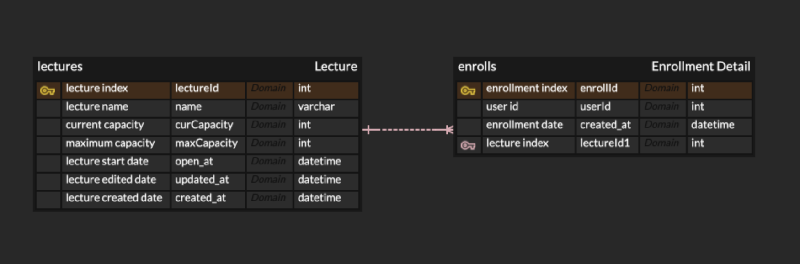
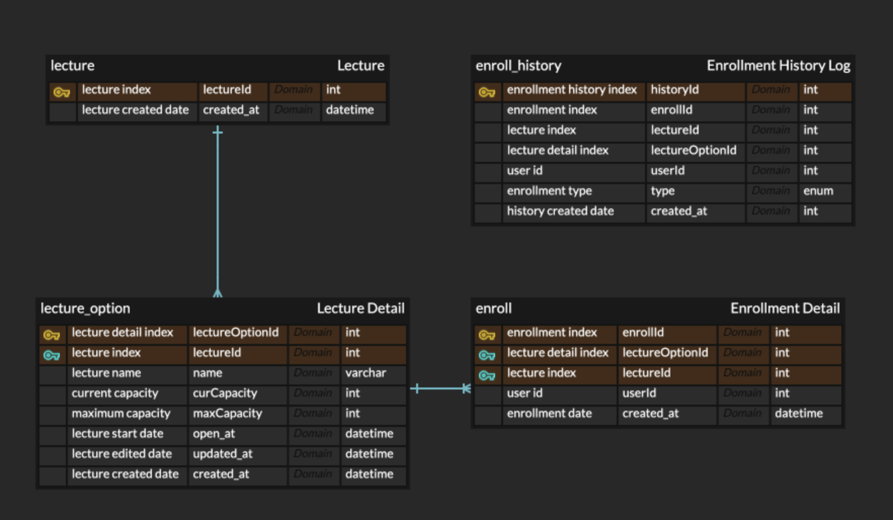

# hhp02_architecture

Task 3

- ERD for Lecture Registration System

Task 4
- Have you considered building extensible data model? 
- Are service responsibilities for each domain separated? 
  - Structure for lecture and enrollment history table
  
